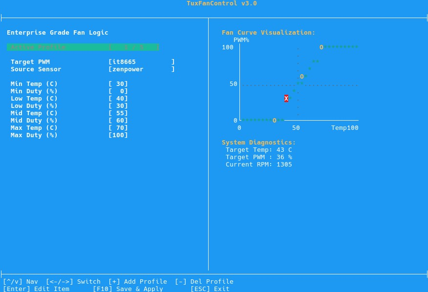

# 🐧 TuxFanControl

[](https://opensource.org/licenses/MIT)
[](https://en.wikipedia.org/wiki/C99)
[](https://www.kernel.org/)

A lightweight and simple application for managing fan speeds on Linux, designed primarily for straightforward server maintenance and headless systems. It features a clean, BIOS-inspired text interface (TUI) for easy profiling and a resilient background daemon that communicates directly with kernel `sysfs` devices.

---

## 📸 Interface



---

## ⚙️ Features

*   **Dynamic Sysfs Binding**: Traditional Linux fan tools rely on fixed `/sys/class/hwmon/hwmonX` paths, which can shuffle randomly after a reboot. TuxFanControl binds profiles directly to hardware device names (like `nct6775` or `coretemp`) and resolves the paths dynamically at startup.
*   **Hardware Fail-Safe Mode**: If a temperature sensor driver crashes or a monitored device is unplugged, the daemon detects the read failure, overrides the curve, and forces **100% PWM fan speed** to prevent overheating.
*   **Minimalist & Lightweight**: Written in pure C with zero modern runtime overhead. It runs with a minimal memory footprint (under 2-3 MB of RAM) and fits easily on production servers, hypervisors, and older hardware.
*   **PID Collision Protection**: Uses standard UNIX file locking (`lockf`) on `/var/run/tuxfan.pid` to prevent multiple background instances from running at the same time or conflicting with active TUI configuration sessions.
*   **Simple Syslog Logging**: Logs system events, configuration changes, and hardware warnings directly to `syslog` / `journald` for easy monitoring.

---

## 🔍 How It Works Under the Hood

When you configure a profile, TuxFanControl links a **PWM Controller** to a **Temperature Sensor** using their physical chip identifier and sub-feature file names (e.g., `pwm1` and `temp1_input`).

1.  **Scanner Phase**: At startup, it scans `/sys/class/hwmon/` to dynamically map these identifiers to the current session's `/sys/class/hwmon/hwmonX` paths.
2.  **Safety Verification**: The daemon operates in a 2-second sleep loop. It polls the resolved temperature path. If the file becomes unreadable, it returns `999000` (999°C), instantly triggering the fail-safe mode.
3.  **Hysteresis/Kickstart**: If a fan was completely stopped (0% PWM) and needs to spin up, the daemon issues a brief, high-voltage burst (100% PWM for 1-2 seconds) to overcome static friction before settling back to the target curve speed.

---

## 🚀 Installation & Setup

We provide a simple deployment script that compiles the code, installs the binary to your system path, and generates a systemd service.

### 1. Clone & Build
```bash
git clone https://github.com/Rompass/tuxfan.git
cd tuxfan
chmod +x install.sh uninstall.sh
sudo ./install.sh
```

### 2. Configure Your System
Launch the TUI to bind your sensors, controllers, and customize temperature curve points:
```bash
sudo tuxfan
```
*   Use `[Arrow Keys]` to navigate.
*   Press `[+]` or `[-]` to manage profiles.
*   Press `[Enter]` on items to bind hardware or edit temperatures/percentages.
*   Press **`[F10]`** to save to `/etc/tuxfan.conf` and activate.
*   Press `[ESC]` to exit.

---

## 🖥️ Systemd Service Management

Once configured, TuxFanControl can be managed as a standard background service.

### Enable on Boot and Start Service
Use this command to make sure the fan controller runs automatically at system startup:
```bash
sudo systemctl enable --now tuxfan
```

### Stop the Service
Safely stop the controller. *Note: Upon shutdown, the service will attempt to restore your fan controllers back to BIOS automatic mode (value 2) or maximum speed as a fallback safety measure.*
```bash
sudo systemctl stop tuxfan
```

### Restart the Service
Required after manually editing `/etc/tuxfan.conf` without using the TUI interface:
```bash
sudo systemctl restart tuxfan
```

### Check Service Status
```bash
sudo systemctl status tuxfan
```

### View Live Syslog Logs
Monitor temperature polls, duty switches, and hardware connection health in real-time:
```bash
journalctl -u tuxfan -f
```

---

## 📋 Configuration File Schema (`/etc/tuxfan.conf`)

Profiles are saved globally, keeping configuration centralized for root and background systemd executions:
```ini
p0_pwm_hw=nct6775
p0_pwm_feat=pwm1
p0_sensor_hw=coretemp
p0_sensor_feat=temp1_input
p0_t0=30
p0_p0=0
p0_t1=50
p0_p1=35
...
```

---

## 🧹 Uninstallation

To cleanly stop background processes, delete the global binary, systemd service descriptors, and optionally remove your profiles config, execute:
```bash
sudo ./uninstall.sh
```

---

## 📄 License

This project is licensed under the MIT License - see the LICENSE file for details.
